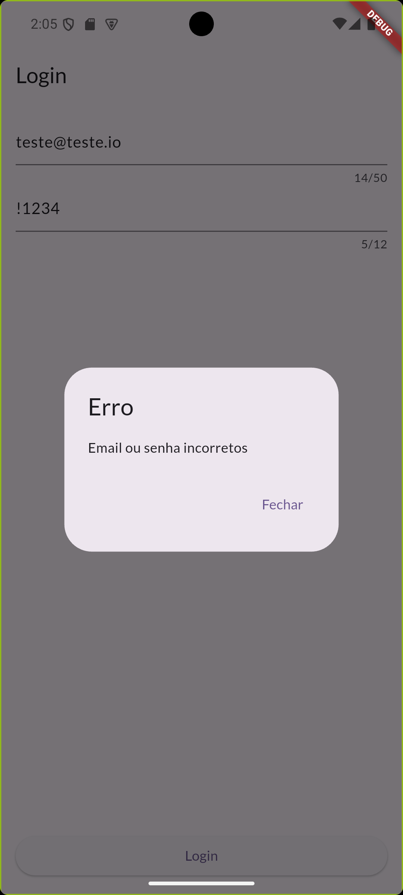

# Conta Azul - Flutter Test

## Considerações iniciais

Esse projeto foi desenvolvido e validado apenas em Android devido a indisponibilidade de acesso ao sistema macOS.

### O que foi utilizado

Para o desenvolvimento desse desafio, foram utilizados os seguintes padrões e dependencias:

    - Arquitetura MiniCore;
    - Flutter Modular para navegação e injeção de dependência;
    - ValueNotifier para gerenciamento de estados;
    - InternetConnectionChecker para verificar a disponibilidade de internet;
    - Pacote http para requisições http;
    - FirebaseAuth para autenticação.

## Features

### Login

A autenticação é realizada utilizando o serviço FirebaseAuth com as seguintes credenciais:

    - teste@teste.com
    - !teste@1234

### Home

A HomePage lista todos os posts retornados pela API, com os estados de carregamento, falha e sucesso.

Na HomePage existem as seguintes ações:

    - Ao clicar no ListTile é redirecionado para a página de detalhes do post;
    - LabelButton na AppBar com o texto "Favoritos" navega para a página de posts favoritosç
    - IconButton de estrala no ListTile de post para favoritar ou desfavoritar o post;
    - FloatingActionButton navega para a página de buscar post por ID.

## Imagens

### Splash

### Login

### Home

### Detalhes

### Posts Favoritos

### Post não encontrado

### Sem conexão

### Procurar post

